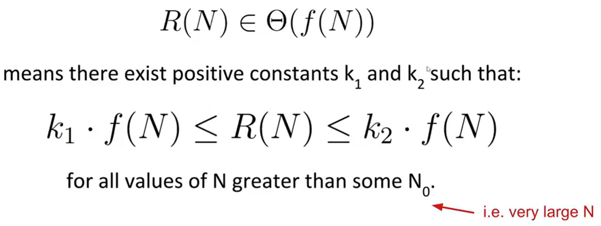
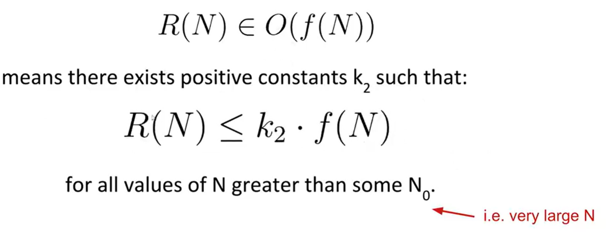

# Lists

## Reference

* Java中有8种基本类型，以及对对象的引用
* 函数传递参数时按值传递，参数为引用类型时传递引用的副本

## SLLists

* 往头部插节点，一种有趣的写法：first = new InnerNode(x, first)
* InnerNode是裸露的数据结构
* SLLists作为一个用户和裸露的数据结构之间的中间人
* sentinel节点：头部多插的一个节点，不必担心空值

## DLLists

* 双向链表

## ALLists

* Java中不允许创建范型数组，可以用
```java
items = (Items[]) new Object[100];
```

# Inheritance

## interface

* 接口本质上是一个合约，指定必须能够做什么，没有提供实现。
* 重写(override)与重载(overloading)：
    * 只有在继承时不改变参数才是重写
    * 只要是同名不同参数就是重载，发生在任何地方

## implementation

1. 仅使用静态类型时，在编译时确定要调用的方法的签名，这种情况下不知道调用对象的动态类型
2. 调用对象时，动态类型决定调用哪种带有该签名的方法

## extends

* 构造函数必须从对其中一个超类构造函数的调用开始
    显式调用super()/super(T x)，如果不指定，会自动调用超类的无参数构造函数。

## Subtype Polymorphism

* Comparator: 可以定义自己的Comparator, 提供了进行回调的能力

## Iterators

* "=="比较位，对于引用，只有当地址相同时才为true

# Asymptotics

## big Theta



## big O



# Disjoint Sets

* 使用LinkedList<Set<Interger>>
    运行时间为O(N)而且代码将非常复杂
* 使用int[]: 快速查找
    connect(x, y)变快了
* 快速联合
    在上一步的基础上给每一个item分配一个父节点
* 加权快速联合
    总是将重量较小的树接在重量较大的树的下面
* 路径压缩
    每当调用时，都必须从根到根遍历路径。因此，在此过程中，可以将访问的所有item连接到它们的根，而无需额外的渐近成本。

# Tree

* B树的每一个节点可以有多个项，每个叶节点到根节点的高度相等
* 红黑树是B树（2-3树）的唯一二叉搜索树对应，更容易实现

# hashing

* 使用哈希函数得出索引
* 像ArrayDeque那样动态的增加减少桶的数量

# heap

* 最小堆：每个节点都小于或等于其两个子节点
* 仅在底层缺失项目（如果有），所有节点都尽可能左侧。
* add：暂时添加到堆的末尾。沿着层次结构向上游到适当的位置，涉及交换节点（如果子节点<父节点）
* removeSmallest：将堆中的最后一项交换到根，然后下沉到适当的位置，涉及交换节点（如果父节点>子节点）。

