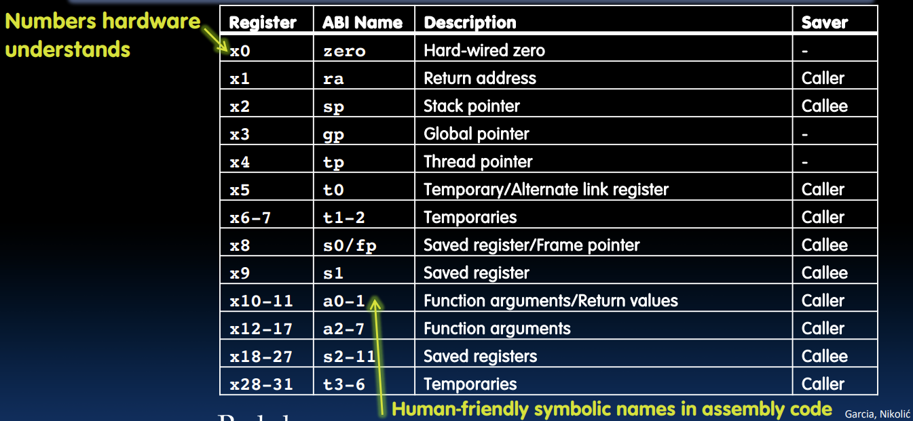
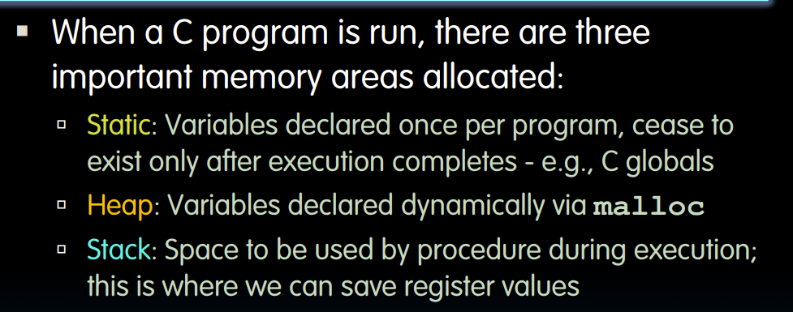
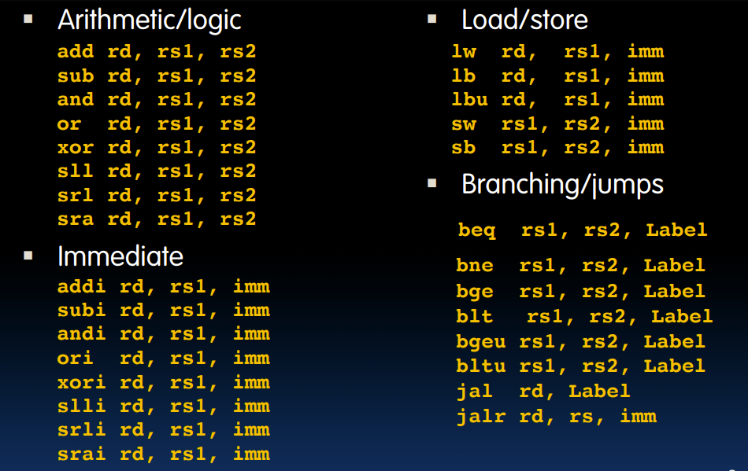
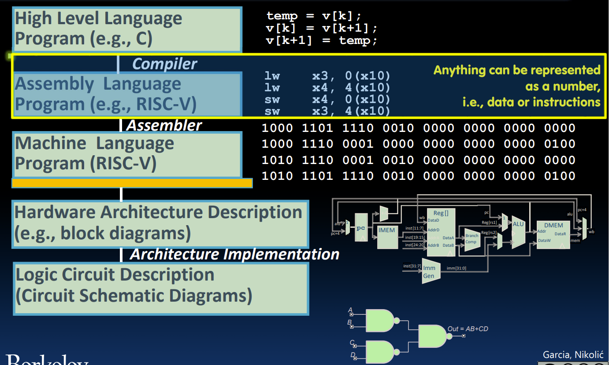

# Function Call Example

* Stack: 暂时存储保存寄存器中的值，使用后再恢复
    * 栈是从上向下增长的

例：
```C
int Leaf (int g, int h, int i, int j) {
    int f;
    f = (g + h) – (i + j);
    return f;
}
```

RISC-V:
```
Leaf: addi sp,sp,-8 # adjust stack for 2 items
sw s1, 4(sp) # save s1 for use afterwards
sw s0, 0(sp) # save s0 for use afterwards
add s0,a0,a1 # f = g + h
add s1,a2,a3 # s1 = i + j
sub a0,s0,s1 # return value (g + h) – (i + j)
lw s0, 0(sp) # restore register s0 for caller 
lw s1, 4(sp) # restore register s1 for caller
addi sp,sp,8 # adjust stack to delete 2 items
jr ra # jump back to calling routine
```

# Nested Calls and Register Conventions

* 保存寄存器：s0-s11，被调用者在使用后要恢复原来的值
* 临时寄存器：t0-t6，其中的值不必恢复
* Symbolic Register Names


# Memory Allocation

* 使用栈：
例：
```C
int sumSquare(int x, int y) {
    return mult(x,x)+ y;
}
```
RISC-V:
```
addi sp,sp,-8 # space on stack
sw ra, 4(sp) # save ret addr
sw a1, 0(sp) # save y
mv a1,a0 # mult(x,x)
jal mult # call mult
lw a1, 0(sp) # restore y
add a0,a0,a1 # mult()+y
lw ra, 4(sp) # get ret addr
addi sp,sp,8 # restore stack
jr ra
```


# In conclusion

目前为止的所有指令：


汇编语言模块到此结束，下一个模块将是机器语言

