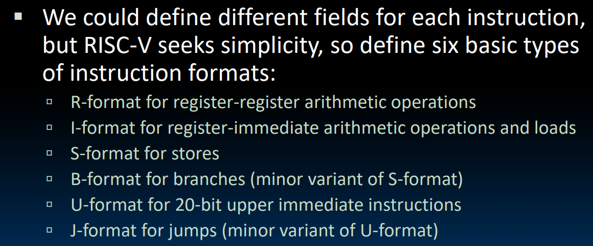
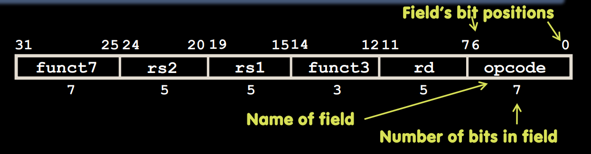
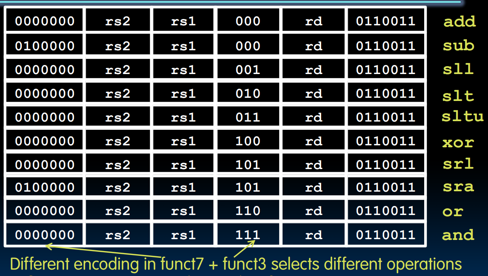
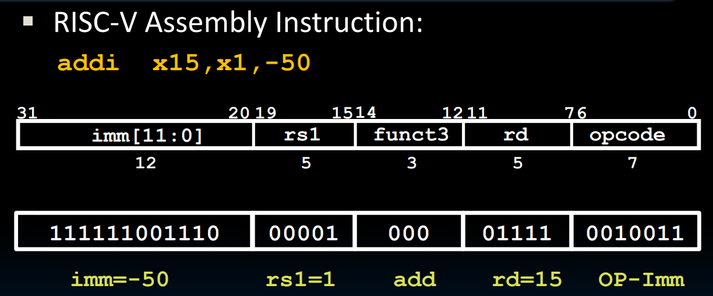
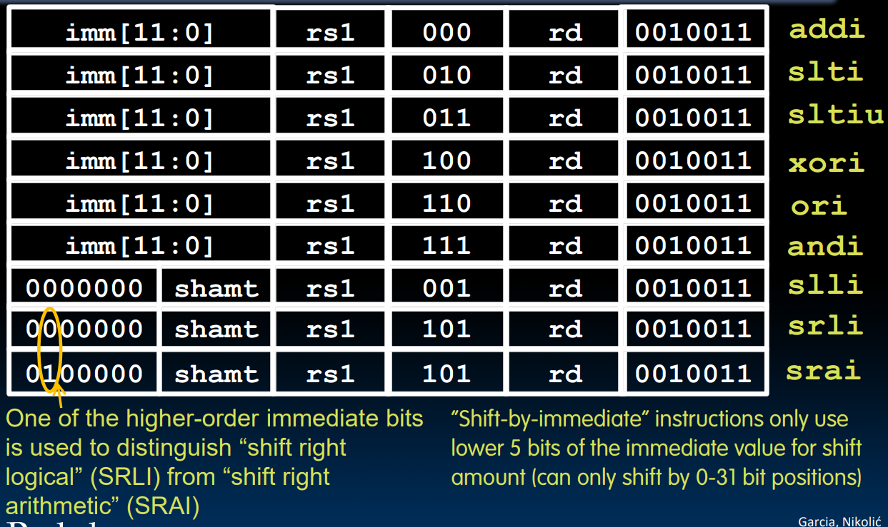
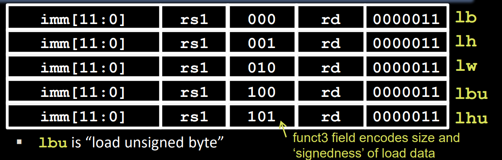
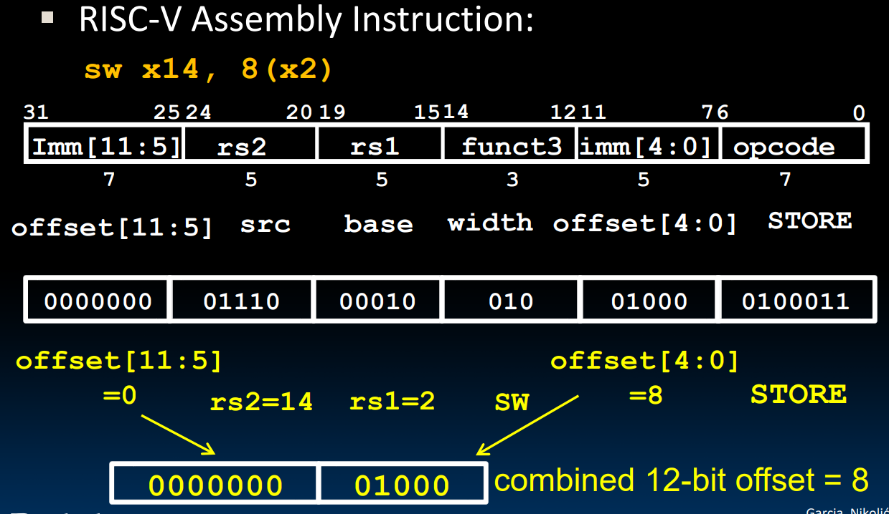
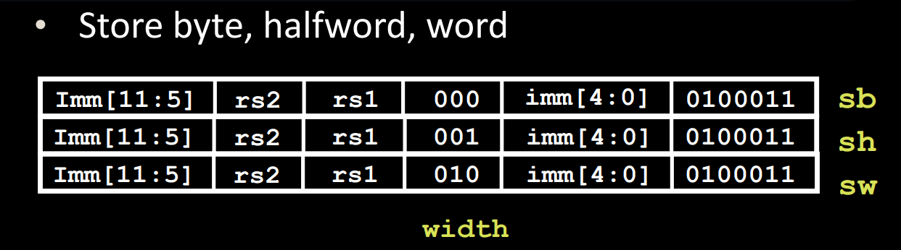

# intro

* 电线 -> 二进制编码

# R-Format

* 用于逻辑或算数的寄存器到寄存器的指令
* 格式：

    * R-format的opcode都为0110011（6位到0位）
    * funct7+funct3决定运行哪种指令（例如add）

# I-Format

* 与寄存器和立即数有关的指令和load

## Load

* 与I类指令格式相同，opcode不同

# S-format

* 只有store指令

