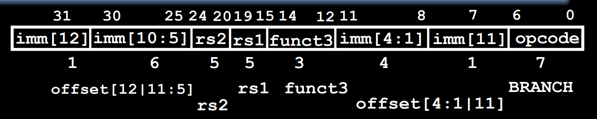
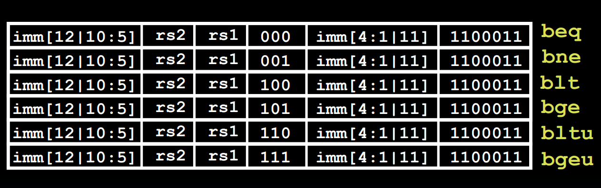
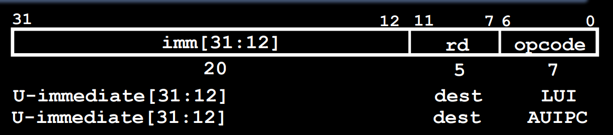
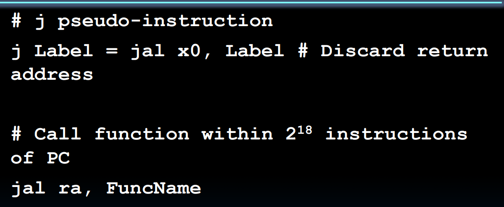

# B-format

* 分支指令
* E.g., beq x1, x2, Label
* branch offset by 2 bytes，PC = PC + immediate * 4
* 立即数不必保存最低有效位，因为PC按字节对的倍数增加，立即数最低位始终为0

# U-format Long immediates

* 在跳转位置在正负1024条指令之外时，单条分支指令做不到
* lui：将一个立即数的高20位加载进寄存器

* addi是按符号位扩展的，与lui搭配有时会出错；实际使用时使用li就行

# J-format

* 跳转，只有jal，j伪指令也使用jal
* jalr伪指令使用了I-format

