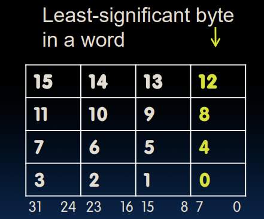
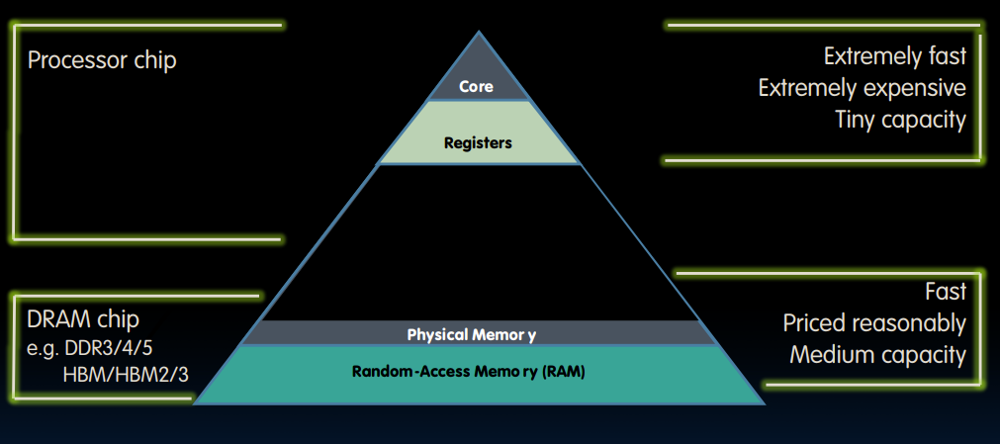

# Storing in Memory

内存中的存储遵守**小端约定**：数据的最低有效字节（Least Significant Byte，LSB）被存储在内存的最低地址处，而最高有效字节（Most Significant Byte，MSB）则存储在内存的最高地址处。

例：要存储一个16位整数 0x1234：
* 在小端约定中，内存的存储方式是：0x34（低地址） 0x12（高地址）。
* 在大端约定中，内存的存储方式是：0x12（低地址） 0x34（高地址）。

* Memory Hierarchy

# Data transfer instruction

## load word

从内存加载至寄存器，数据流是从右到左的

* 对于int A[100]：
lw：lw x10,12(x15) # Reg x10 gets A[3]，12是偏移量

## store word

将寄存器中的数据存储到内存中，数据流是从左到右的

* 对于int A[100]：
sw x10,40(x15) # A[10] = h + A[3]

## load byte and store byte

RISC-V中除了lw、sw（字操作）之外，还提供lb、sb（字节操作）指令

**Lec7 第3节**