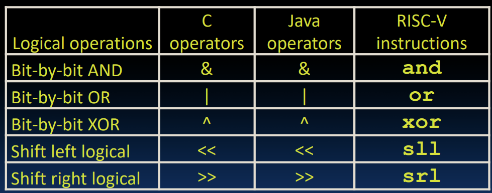
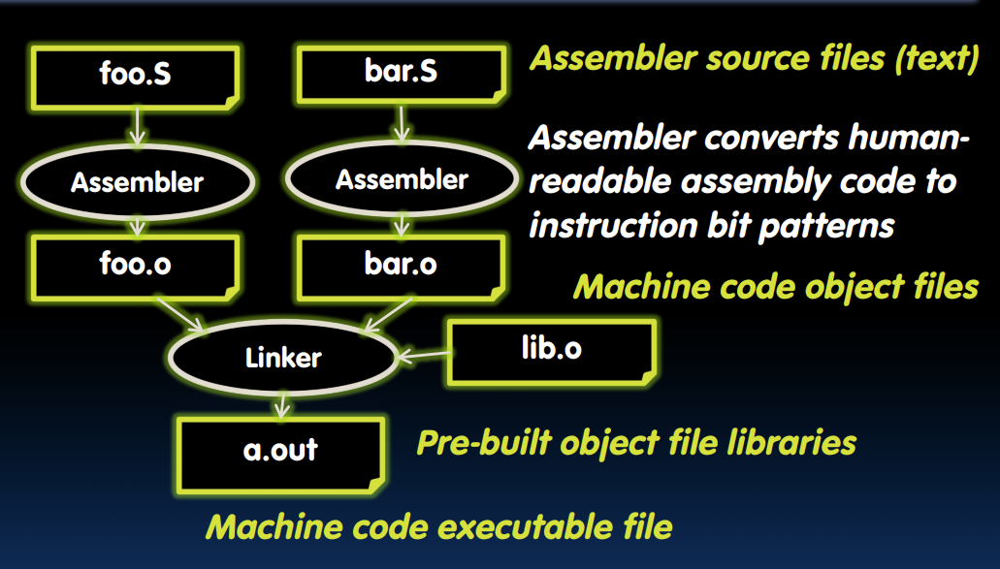

# Logical instructions

* 逻辑左移：sll，立即数：slli
slli x11,x12,2 #x11=x12<<2
* 逻辑右移与逻辑左移同理
* 运算移位：只有右移，最高位用符号位填充，sra，srai

# Assembler to Machine Code

* 为寄存器起别名
* 伪指令：
    * mv rd, rs = addi rd, rs, 0
    * li rd, 13 = addi rd, x0, 13
    * nop = addi x0, x0, 0

# Function Calls

* 六个步骤：
    1. 把参数放在函数可以访问的位置
    2. 把控制权转移到函数
    3. 函数访问资源
    4. 函数进行任务
    5. 把返回值放到合适的位置，恢复寄存器 
    6. 把控制权转移回主函数

# Function Call Convention

* a0–a7(x10-x17): 参数寄存器
* ra(x1): 返回地址寄存器
* s0-s1(x8-x9), s2-s11(x18-x27): 保存寄存器
* jump register(jr): jr ra
    ret = jr ra
* jump and link(jal): 
    * Before:
    1008 addi ra,zero,1016 # ra=1016
    1012 j sum # goto sum
    * After:
    1008 jal sum # ra=1012,goto sums
* jump and link register(jalr): 
    jalr rd, rs, imm
