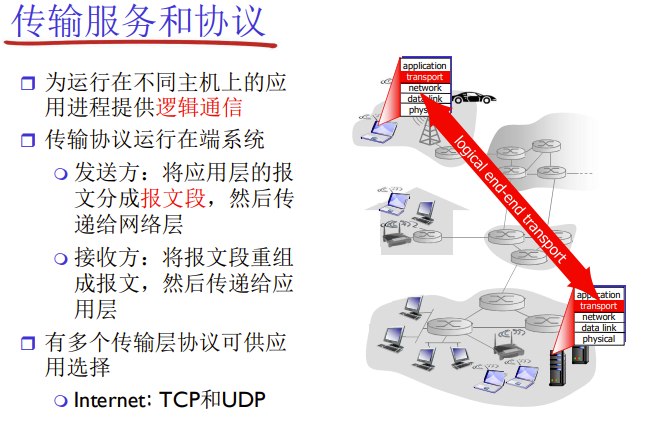
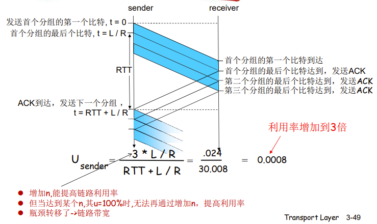
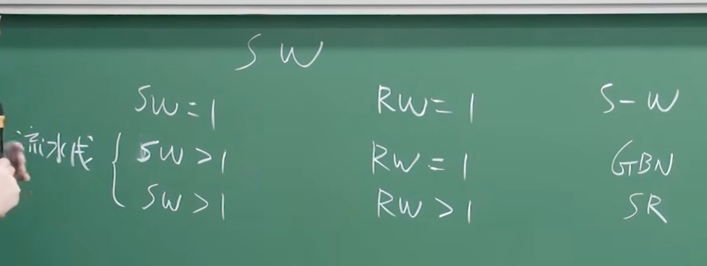
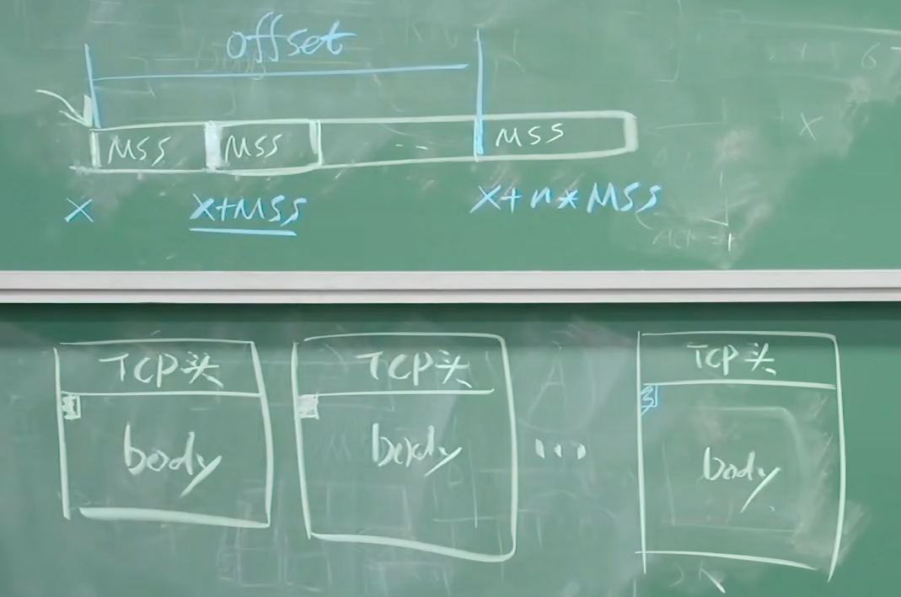
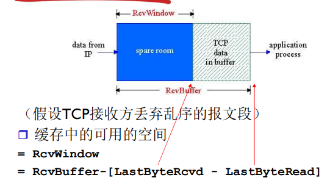
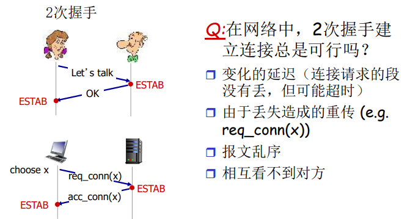
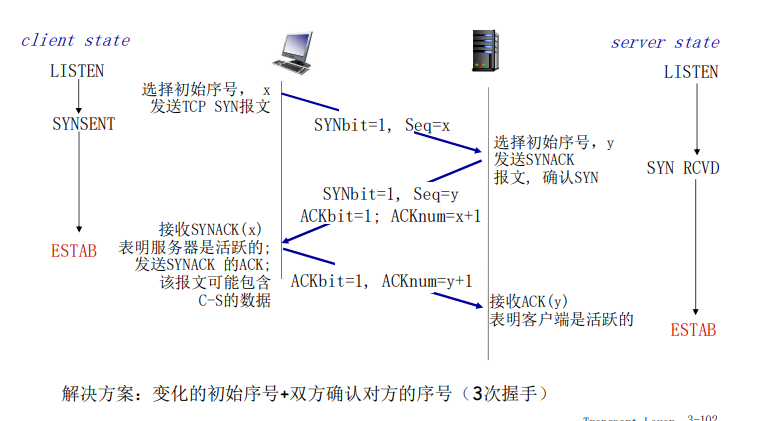
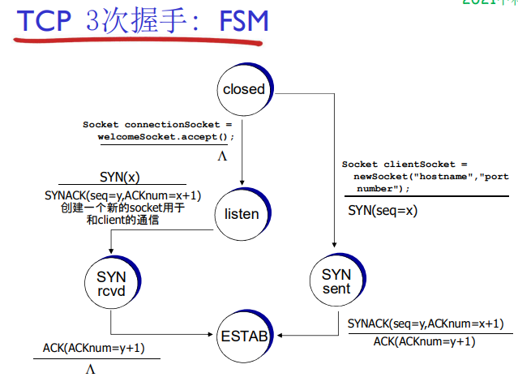
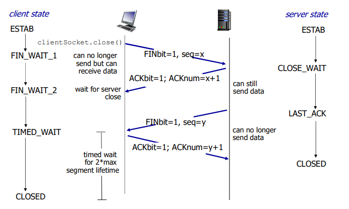

# 3.1 概述和传输层服务

网络层向上层提供的服务可以丢失、重排、出错，传输层在网络层提供的服务的基础上对可靠性的不足加以弥补，从而向上层提供可靠的服务（由rdt实现）。

## 传输层向上层提供的服务：
* 为应用层提供逻辑的通讯服务
* **进程与进程**之间以message为单位的逻辑的通信
  * 依赖于网络层的服务（延时、带宽）
  * 并对网络层的服务进行增强
* 多路复用，解复用
* 带宽和延时不可以被加强。

* TCP协议：可靠、保序的传输。
    * **字节流**的服务
    * 多路复用、解复用
    * 拥塞控制
    * 流量控制
    * 建立连接

* UDP协议：不可靠，不保序的传输，没有为尽力而为的IP服务添加更多的其它额外服务。
    * **数据报**的服务
    * 多路复用、解复用

# 3.2 多路复用与解复用

看PPT就行

* TCP整合四元组（源IP，源port，目标IP，目标port）
* UDP整合二元组（目标IP，目标port）

# 3.3 无连接传输：UDP

## UDP：User Datagram Protocol

* 无连接，发送端和接收端之间没有握手，报文段可能丢失，乱序
* UDP被用于：
    * 流媒体（丢失不敏感，速率敏感、应用可控制传输速率） 
    * DNS
    * SNMP
* 要想在UDP上进行可靠传输，需要在应用层增加可靠性
* UDP的优点：  **PPT 3-21**

## UDP校验和

* 将报文段的内容视为16比特的整数，计算报文段的加法和（1的补运算）
* 目标： 检测在被传输报文段中的差错 (如比特反转)
* 将报文段视为16bit的整数，求和作比较
* 校验和也有可能检测不出问题（残存错误）

# 3.4 可靠数据传输的原理

可靠数据传输（rdt）：网络层向上层提供的服务可以丢失、重排、出错，传输层在网络层提供的服务的基础上对可靠性的不足加以弥补，从而向上层提供可靠的服务。

* rdt在应用层、传输层和数据链路层都很重要
* 信道的不可靠特点决定了可靠数据传输协议（rdt）的复杂性

使用有限状态机 (**FSM**) 来描述发送方和接收方

## Rdt1.0： 在可靠信道上的可靠数据传输

* 下层的信道是完全可靠的
    * 没有比特出错
    * 没有分组丢失
* 发送方和接收方的FSM
    * 发送方将数据发送到下层信道
    * 接收方从下层信道接收数据
* 只做封装、解封装工作

## Rdt2.0：具有比特差错的信道

* 下层信道可能会出错：将分组中的比特翻转
* 从差错中恢复：接收方显式地发送确认（ACK）或否定确认（NAK），发送方收到NAK后重传。

## rdt2.0的致命缺陷！-> rdt2.1

* rdt2.0无法处理ACK/NAK出错的情况
* rdt2.1引入新的机制：序号（两个序列号（0，1）就足够了）
* 处理重复：
    * 发送方在每个分组中加入序号
    * 如果ACK/NAK出错，发送方重传当前分组
    * 接收方丢弃（不发给上层）重复分组
* 接收方必须检测接收到的分组是否是重复的
* 状态数变成了两倍
* 接收方不知道它最后发送的ACK/NAK是否被正确地收到，发送方不对收到的ack/nak给确认，没有所谓的确认的确认。

## rdt2.2 无NAK的协议

* 功能同rdt2.1，但只使用ACK（ack 要编号）
* 接收方对最后正确接收的分组发ACK，以替代NAK，接收方必须显式地包含被正确接收分组的序号
* 发送方收到重复的ACK（如：再次收到ack0）时，重传当前分组

## rdt3.0：具有比特差错和分组丢失的信道

* 新的假设：下层信道可能会丢失分组（数据或ACK）
    * 会死锁
    * 现有的机制还不够处理这种情况
* 方法：发送方等待ACK**一段合理的时间**
* 设置一个合理的超时时间也是比较重要的
* 在链路容量比较大的情况下，rdt3.0性能很差：网络协议限制了物理资源的利用，链路容量比较大，一次发一个PDU 的不能够充分利用链路的传输能力

## 流水线协议

* 允许发送方在未得到对方确认的情况下一次发送多个
分组
* 需要增加序号的范围
* 在发送方/接收方要有缓冲区：上层用户取用数据的速率是不一致的，需要缓冲区抵消速率的不一致性
* 回退N步（GBN）和选择重传（SR）

## 滑动窗口(slide window)协议

### 发送窗口

发送缓冲区和接收缓冲区的大小：

* 发送窗口是发送缓冲区的子集，用于存放已发送未确认的分组。

**PPT 3-52到3-58**

### 接收窗口

* 接收窗口 (receiving window) = 接收缓冲区

**PPT 3-59到3-61**

### 窗口互动

**PPT 3-62到3-74**，3-74中的n是分组序号的位数（n = 2, 序列号0,1,2,3）

# 3.5 面向连接的传输：TCP

## 段结构

* TCP概述：PPT 3-75
* TCP报文段中的序号是报文段首字节的在字节流的编号，不是前面的分组序号。

* 确认号:期望从另一方收到的下一个字节的序号
* TCP往返延时（RTT）和超时：对几个最近的测量值求平均，而不是仅用当前的SampleRTT
    * $EstimatedRTT = (1 - α) * EstimatedRTT + α * SampleRTT$
    * 指数加权移动平均
    * 推荐值：α = 0.125

* 设置超时：EstimtedRTT + 安全边界时间
    * $DevRTT = (1 - β) * DevRTT + β * SampleRTT-EstimatedRTT|$ (推荐值β = 0.25)
* 超时时间间隔设置为：$TimeoutInterval = EstimatedRTT + 4 * DevRTT$

## 可靠数据传输

* TCP在IP提供的不可靠服务的基础上向上提供可靠的服务
* TCP协议是GBN和SR的混合体
    * 只设置一个计时器（GBN）
    * 超时后只发最早的段（SR）
* 通过以下事件触发重传
    * 超时（只重发那个最早的未确认段：SR）
    * 重复的确认，例子：收到了ACK50，之后又收到3个ACK50

首先考虑简化的TCP发送方：
* 忽略重复的确认
* 忽略流量控制和拥塞控制
* 发送方事件：**PPT 3-86**
* 快速重传：解决冗余，在定时器过时之前重发报文段**PPT 3-91**

## 流量控制

* 流量控制：接收方控制发送方，不让发送方发送的太多、太快以至于让接收方的缓冲区溢出
* 接收方在其向发送方的TCP段头部的rwnd字段“通告”其空闲buffer大小，保证接收方不会被淹没

## 连接管理

* 在正式交换数据之前，发送方和接收方握手建立通信关系:
    * 同意建立连接（每一方都知道对方愿意建立连接）
    * 同意连接参数

### 建立连接

* 两次握手：

不总是可行：可能会半连接、老的数据被当成新的数据接受

* 三次握手：

解决了半连接和接收老数据问题

### 关闭连接

* TCP的连接释放并不完美，把一个连接拆成两个半连接
* 客户端，服务器分别关闭它自己这一侧的连接，发送FIN bit = 1的TCP段
* 一旦接收到FIN，用ACK回应  接到FIN段，ACK可以和它自己发出的FIN段一起发送
* 可以处理同时的FIN交换

