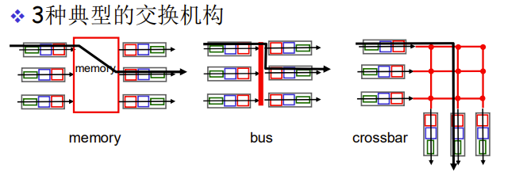
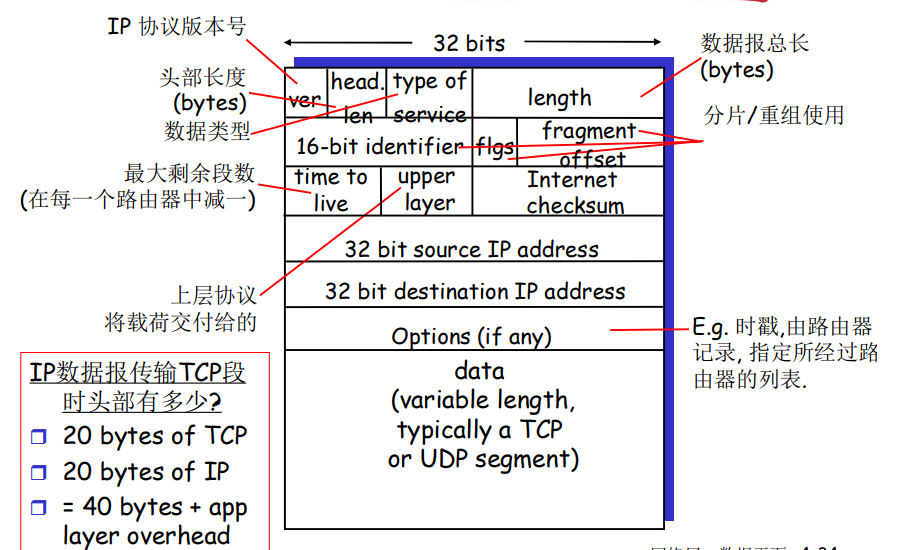
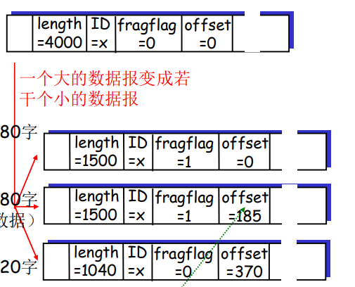
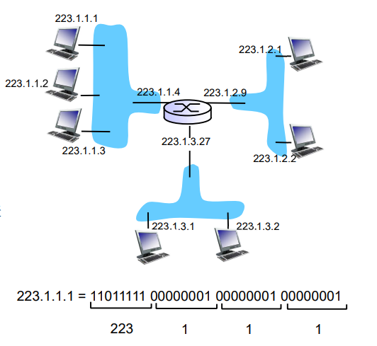
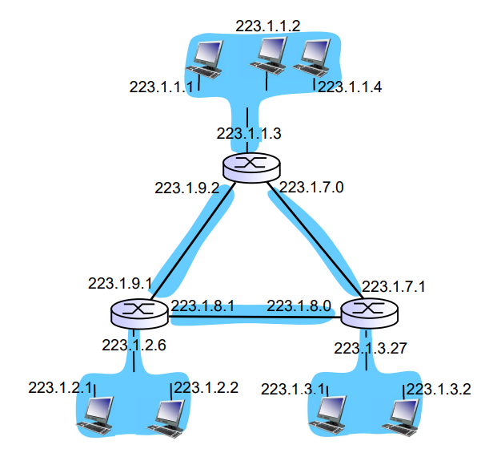
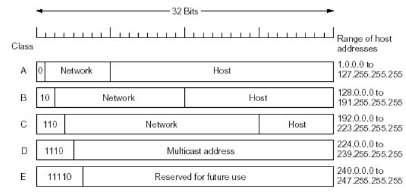
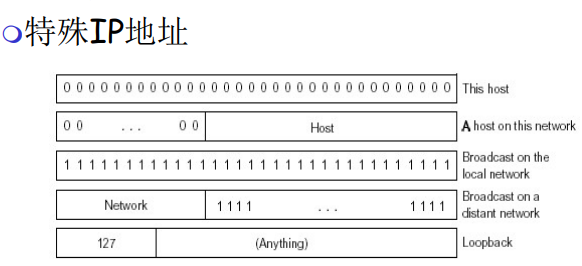
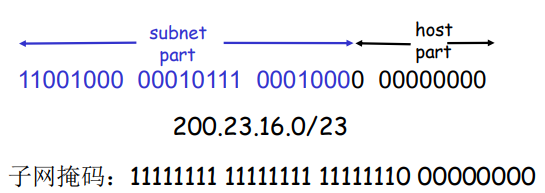
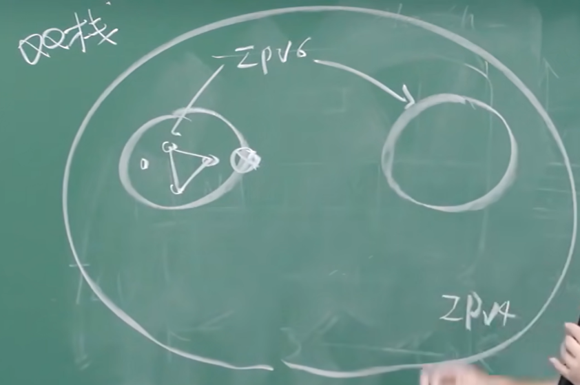
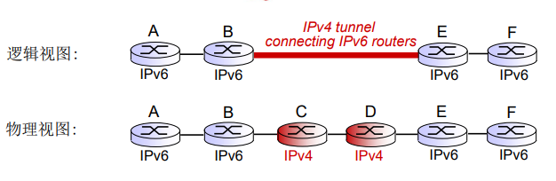

# 4.1 导论

* 本章：网络服务的基本原理，聚焦于其数据平面

## 网络层服务

* 在发送主机和接收主机对之间传送段（segment）
* 在发送端将段封装到数据报中
* 在接收端，将段上交给传输层实体
* 网络层协议存在于主机和路由器
* 路由器检查每一个经过它的IP数据报的头部

## 网络层的关键功能

* 转发
    将分组从路由器的输入接口转发到合适的输出接口
* 路由
    * 使用路由算法来决定分组从发送主机到目标接收主机的路径
    * 路由选择算法
    * 路由选择协议
* 数据平面
    * 本地
    * 决定从路由器输入端口到达的分组如何转发到输出端口
* 控制平面
    * 网络范围
    * 决定数据报如何在路由器之间路由，决定数据报从源到目标主机之间的端到端路径
* 控制平面方法：
    * 传统的路由算法: 在路由器中被实现
    * software-defined networking(SDN): 在远程的服务器中实现

## 网络服务模型

* 对于单个数据报的服务
    * 可靠传送
    * 延迟保证
* 对于数据报流的服务:
    * 保序数据报传送
    * 保证流的最小带宽
    * 分组之间的延迟差

## 连接建立

* 在分组传输之前，在两个主机之间，在通过一些路由器所构成的路径上建立一个网络层连接
* 与传输层连接的区别
    * 网络层: 在2个主机之间，涉及到路径上的一些路由器
    * 传输层: 在2个进程之间，很可能只体现在端系统(例如TCP)

# 4.2 路由器组成

* 结构概括
    * 路由：运行选择算法／协议 (RIP, OSPF, BGP)-生成路由表
    * 转发：从输入到输出链路交换数据报-根据路由表进行分组的转发
    * 任何端口实际上既是输入端口也是输出端口
* 输入端口功能
    **PPT 4-16**
* 当给定目标地址查找转发表时，采用最长地址前缀匹配的目标地址表项
* 当交换机构的速率小于输入端口的汇聚速率时，在输入端口可能要排队
    * 需要一个缓存队列
* 交换结构
    * 将分组从输入缓冲区传输到合适的输出端口
    * 
* 通过内存交换
    * 转发速率被内存的带宽限制 (数据报通过BUS两遍)
    * 一次只能转发一个分组
* 通过总线交换
    * 交换速度受限于总线带宽
    * 1次处理一个分组
* 通过互联网络(crossbar等)的交换
    * 同时并发转发多个分组，克服总线带宽限制

# 4.3 IP: Internet Protocol

* IP 协议 
    * 地址约定
    * 数据报格式
    * 分组处理的约定
* ICMP 协议 
    * 错误报告
    * 路由器信令

## IP 数据报格式

* 头部长度必须是4的倍数，head len**以1当4字节**，最少是5，head len = 5时头部长度为20字节
* head len - 5即为可选项长度

## IP 分片和重组

* 网络链路有MTU (最大传输单元) –链路层帧所携带的最大数据长度，因此大的数据报在网络上被分片。
* 一个数据报被分割成若干个小的数据报
    * 相同的ID
    * 不同的偏移量，偏移量offset**以1当8字节**
    * 最后一个分片标记为0
    * “重组”只在最终的目标主机进行

* 例子：
    * 4000 字节数据报
    * 20字节头部
    * 3980字节数据
    * MTU = 1500 bytes

## IPv4地址

* IP 地址: 32位标示，对主机或者路由器的接口编址

* 接口: 主机/路由器和物理链路的连接处，主机和路由器都可以有多个接口
* **一个IP地址和一个接口相关联**

### 子网(Subnets)

* 子网(subnet)
    * 一个子网内的节点（主机或者路由器）它们的IP地址的高位相同，这些节点构成的网络的一部分叫做子网
    * 无需路由器介入，子网内各主机可以在物理上相互直接到达（使用交换机）

$$图中有6个子网$$

### IP 地址分类

* Class A：126 networks ，16 million hosts
* Class B：16382networks ，64 K hosts
* Class C：2 million networks ，254 host
* Class D：multicast
* Class E：reserved for future

### 特殊IP地址

* 子网部分: 全为0---本网络
* 主机部分: 全为0---本主机
* 主机部分: 全为1--广播地址，这个网络的所有主机

* 127.：回调地址

### 内网(专用)IP地址

* 专用地址：地址空间的一部份供专用地址使用
* 永远不会被当做公用地址来分配, 不会与公用地址重复
* 只在局部网络中有意义，区分不同的设备
* 路由器不对目标地址是专用地址的分组进行转发
* 专用地址范围
    * Class A 10.0.0.0-10.255.255.255 MASK 255.0.0.0
    * Class B 172.16.0.0-172.31.255.255 MASK 255.255.0.0
    * Class C 192.168.0.0-192.168.255.255 MASK 255.255.255.0

### IP 编址: CIDR

* CIDR: Classless InterDomain Routing （无类域间路由）
* 可以任意划分子网位置
* 具体的划分位置路由器查看掩码确定

### 子网掩码(subnet mask)
* 32bits , 0 or 1 in each bit
* 1: bit位置表示子网部分
* 0:bit位置表示主机部分

### 转发表和转发算法

* 用于获得IP数据报的目标地址
* 对于转发表中的每一个表项，如 (IP Des addr) & (mask)== destination, 则按照表项对应的接口转发该数据报，如果都没有找到，则使用默认表项转发数据报

### DHCP: Dynamic Host Configuration Protocol

**PPT 4-50 -- 4-56**
* DHCP是驻留在UDP上的服务

### IP 编址: 如何获得一块地址

**PPT 4-60**
* ICANN：一个权威机构
* 层次编址: 路由聚集
    层次编址允许路由信息的有效广播

## NAT：网络地址转换

* 用于将私有网络中的IP地址转换为公共网络中的IP地址
* 动机: 使用NAT后，本地网络只有一个有效IP地址即可
    * 省钱
    * 安全
    * 内外改变不必同步
* 实现: NAT 路由器必须：
    * 替换源地址和端口号为NAT IP地址和新的端口号，目标IP和端口不变（或相反的操作）
    * 记住每个转换替换对（在NAT转换表中）
* NAT是有一些争议的

## IPv6地址

* IPv6：动机：
    * 主要：32-bit地址空间将会被很快用完
    * 头部格式可以改变
* IPv6 数据报格式:
    * 固定的40 字节头部
    * 数据报传输过程中，不允许分片，分组太大就丢弃，叫源主机下一次发小一点
* IPv6头部：**PPT 4-71**
* 与IPv4的其他变化：**PPT 4-72**
* v4到v6的过渡：
    * 平滑地升级
    * 双栈，内部v6，外部v4
    
    * 隧道: 在IPv4路由器之间传输的IPv4数据报中携带IPv6数据报
    

# 4.4 通用转发和SDN

## 传统方式

* 每个路由器实现了控制平面的部分功能，采用分布式方式实现
* 缺点：
    * 网络设备非常多
    * 部署后更改工作方式困难
* 垂直集成，硬件软件厂商捆绑
* 缺点：昂贵、不便于创新的生态

## SDN：逻辑上集中的控制平面

* 主要思路：将网络设备数据平面和控制平面分离
* 成本低
* 好的产业生态
* 管理容易，随时可以升级
* 更容易实现流量工程
