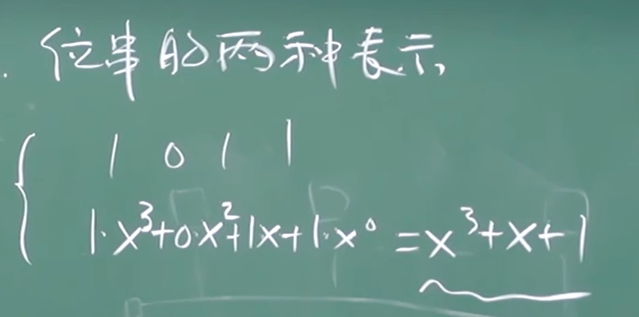
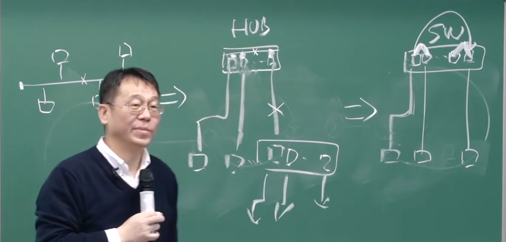

# 6.1 引论和服务

* 链路层功能：
    * 将数据报成帧
    * 在一个子网的内部，点到点（**主机或者路由器**）传输层功能
* 在低出错率的链路上（光纤和双绞线电缆），由于本身可靠性高，实现的是不可靠的服务
* 在无线链路上，本身出错率高，实现可靠的服务

# 6.2 差错检测和纠正

* 奇偶校验：最后附加一位数据中为1的位的总数，偶数为0，奇数为1
    * 单bit奇偶校验
    * 2维奇偶校验
* CRC（循环冗余校验）

    * 进行二进制除法，每一步都进行异或操作，最后得出余数
* 性能分析：**PPT 6-21**

# 6.3 多点访问协议

* 多点连接的网络中需要访问协议

## 信道划分

* 时分：TDMA
* 频分：FDMA
* 码分：CDMA

## 随机访问

* 随机存取协议规定: 如何检测冲突、如何从冲突中恢复
* 时隙ALOHA：
    * 划分时隙，冲突后概率p随机决定是否重发
    * 节点在时钟上要保持同步
    * 信道利用率不高
* 纯ALOHA(非时隙)
    * 简单、无须节点间在时间上同步
    * 冲突概率增加，利用率更低
* CSMA：
    * 在发送之前先检测有没有节点正在发送
    * 依靠局部的探知来判断全局的使用情况
    * 冲突仍然有可能发生
* CSMA/CD(冲突检测)
    * 一边发送一边监听
    * 检测到冲突立即停止发送
    * 强化冲突：让所有站点都知道冲突
    * 使用二进制指数退避算法
* CSMA/CA(冲突避免)
    * 冲突检测在无线网络中不可行
    * 允许发送方“预约”信道，而不是随机访问

## 轮流(Taking Turns)

* 信道划分适合高负载，随机访问适合低负载
* 轮流在高低负载下表现都很好，但是太复杂
* 轮询
    * 集中式的
    * 一个master节点负责询问
    * 有可靠性的问题
* 令牌
    * 分布式的

# 6.4 LANs

## MAC地址和ARP

* MAC地址
    * 48位，写死在网卡上
    * 用于在网络的内部区分节点
* ARP协议
    * 完成IP地址到MAC地址的转换
    * 即插即用，无需管理员干预

## 以太网

* 物理拓扑：总线->集线器->交换机

* 在接收方使用CRC校验
* 无连接，不可靠的服务
* 使用CSMA/CD
* 集线器Hubs本质上是物理层的中继器
* Manchester 编码
    * 每个位时中间的跳变代表传输的数据
    * 极端情况下可能出错（全0、全1）
* 4b5b编码
    * 确保每几个比特之间有跳变
* 在LAN中，如果一个帧的发送持续时间≥$2τ$，不碰撞=发送成功
    * $τ$：最远两个节点之间的传播延迟

## switches

* 集线器
    * 一个端口收，向所有端口转发
    * 本质上是物理层的中继器
    * 所有以hub连到一起的站点处在一个网段，处在一个碰撞域，同一时刻只能由一个设备成功发送
* 交换机
    * 一个端口收，向指定的端口转发
    * 在转发之前把帧保存下来
    * 自学习：记录发送方MAC地址/进入端口映射关系
    * 三种可能：过滤/特定转发/泛洪

